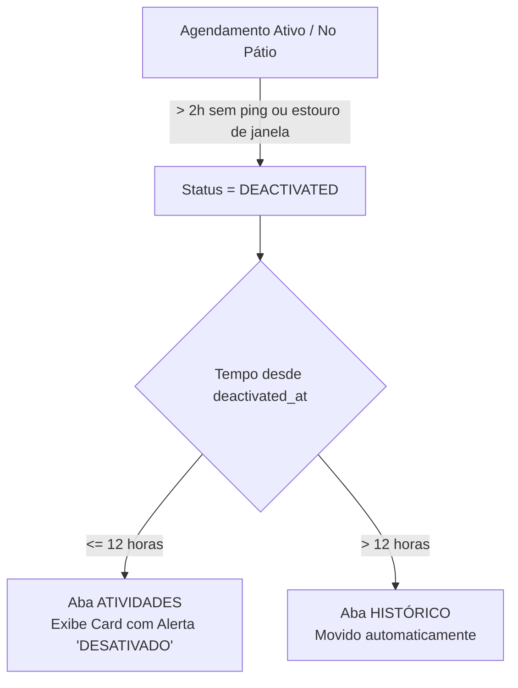

# 📌 Regras de Agendamento, Status em PT-BR e Lifecycle de Desativação

Este documento consolida as regras de negócio para status de agendamentos no GateIn, mapeamento de traduções (PT-BR), regras de exibição de alertas no card do motorista, tolerância de ping do terminal, desativação por inatividade e ciclo de visibilidade de 12h na aba "Atividades" antes da migração para o "Histórico".

---

## 1. Mapeamento de Status para Português Brasil (PT-BR)

Todos os status armazenados no banco de dados (enums em inglês) devem ser exibidos ao usuário na interface em Português Brasil (PT-BR) de forma amigável:

| Código Backend (Enum) | Rótulo PT-BR (App / Web) | Descrição do Estado | Cor Recomendada |
| :--- | :--- | :--- | :--- |
| `ACTIVE` | **Agendado** | Agendamento confirmado aguardando a data/hora programada | Azul (`#3B82F6`) |
| `CHECKED-IN` | **No Pátio** | Check-in realizado no terminal, aguardando chamada/operação | Amarelo (`#EAB308`) |
| `ON_GOING` | **Em Andamento** | Operação de carga/descarga em execução no terminal | Laranja (`#F59E0B`) |
| `PAUSED` | **Pausado** | Operação temporariamente interrompida | Laranja Escuro (`#D97706`) |
| `COMPLETED` | **Concluído** | Operação finalizada com sucesso | Verde (`#10B981`) |
| `CANCELLED` | **Cancelado** | Agendamento cancelado pelo motorista, terminal ou sistema | Vermelho (`#EF4444`) |
| `DEACTIVATED` | **Desativado** | Agendamento desativado por inatividade ou estouro de tolerância | Vermelho Escuro (`#DC2626`) |
| `OVERDUE` / `EXPIRED` | **Atrasado** | Janela de agendamento encerrada sem check-in realizado | Vermelho (`#EF4444`) |

---

## 2. Alertas Dinâmicos no Card do Motorista

Os cards de agendamento no aplicativo móvel possuem indicadores visuais (badges e alertas) baseados no horário atual (`now`) e tolerâncias:

1. **Badge Status Principal**: Exibe sempre o status traduzido em Português (ex: `Agendado`, `No Pátio`, `Em Andamento`).
2. **Alerta de Janela Aberta** (`JANELA ABERTA`):
   - Exibido quando `status == ACTIVE` e `window_start - start_tolerance <= now <= window_end + end_tolerance`.
3. **Alerta de Encerramento Próximo** (`ENCERRANDO EM BREVE`):
   - Exibido quando `status == ACTIVE` e faltarem 15 minutos ou menos para o término da janela programada (`window_end + end_tolerance`).
4. **Alerta de Atraso** (`ATRASADO`):
   - Exibido como alerta destacado quando `status == ACTIVE` e `now > window_end + end_tolerance`.
5. **Alerta de Desativação** (`DESATIVADO`):
   - Exibido em destaque vermelho quando `status == DEACTIVATED` durante os primeiros 12 horas após a desativação.

---

## 3. Tolerância de 2 Horas e Keep-Alive por Ping do Terminal

Para garantir que agendamentos inativos não fiquem travados indefinidamente nas telas operacionais e do motorista:

### A. Agendamento com Janela Expirada (`ACTIVE`)
- Quando o horário atual ultrapassa a janela final (`now > window_end + end_tolerance`), o agendamento entra no estado temporário de **Atrasado**.
- O sistema concede uma **tolerância máxima de 2 horas** aguardando uma ação/ping do terminal.
- Se o terminal **não pingar ou atualizar o agendamento em até 2 horas**:
  - O status é alterado automaticamente para `DEACTIVATED`.
  - É registrado o timestamp `deactivated_at = now()`.

### B. Agendamentos no Pátio ou Em Operação (`CHECKED-IN`, `ON_GOING`, `PAUSED`)
- O terminal deve enviar confirmações de presença/manutenção de estado através do endpoint de **Ping**.
- Se o agendamento permanecer **mais de 2 horas sem ping** (`last_ping_at < now - 2h` ou `updated_at < now - 2h`):
  - O agendamento é automaticamente classificado como abandonado/desativado.
  - O status transiciona para `DEACTIVATED`.
  - É registrado o timestamp `deactivated_at = now()`.

---

## 4. Ciclo de Visibilidade de 12 Horas: Atividades ➡️ Histórico

A transição de tela para agendamentos desativados ocorre em duas fases para que o motorista seja notificado de forma clara no app:



1. **Primeiras 12 Horas após Desativação (`deactivated_at >= now - 12h`)**:
   - O agendamento permanece visível na aba **Atividades** do aplicativo móvel.
   - Apresenta o alerta de aviso destacado de que foi **DESATIVADO**, alertando o motorista de forma transparente.
2. **Após 12 Horas (`deactivated_at < now - 12h`)**:
   - O agendamento deixa de aparecer na aba Atividades e é migrado automaticamente para a aba **Histórico**.

---

## 5. Endpoint de Ping do Terminal (`POST /api/v1/public/appointments/ping`)

O terminal (integrador/sistemas de portaria) deve utilizar este endpoint para notificar que o agendamento permanece ativo e operando.

### Requisição
- **Método**: `POST`
- **URL**: `/api/v1/public/appointments/ping`
- **Cabeçalho de Autenticação**: `X-API-Key: <CHAVE_DE_API_DO_TERMINAL>`

### Body Payload (JSON)
```json
{
  "terminal_id": "3fa85f64-5717-4562-b3fc-2c963f66afa6",
  "appointment_refs": [
    "AG-2026-00123",
    "AG-2026-00124"
  ]
}
```

### Resposta (200 OK)
```json
{
  "success": true,
  "message": "2 agendamento(s) pingado(s) com sucesso.",
  "data": {
    "pinged_refs": ["AG-2026-00123", "AG-2026-00124"],
    "pinged_at": "2026-07-20T21:08:00Z"
  }
}
```

---
*Documento mantido pela equipe de engenharia GateIn.*
