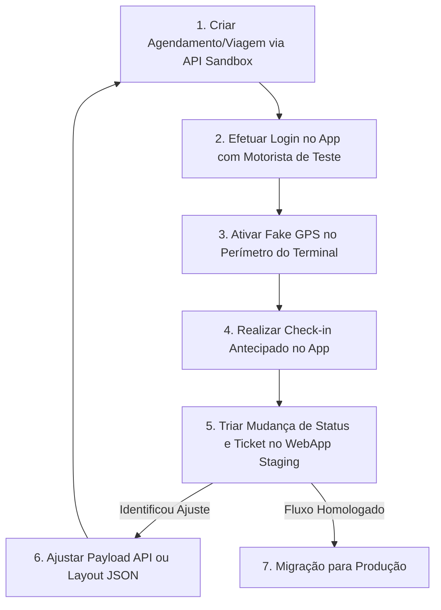

# Guia de Homologação, Testes e Migração para Produção

Este guia prático ensina passo a passo como testar funcionalidades, triar cenários de uso, simular acessos no aplicativo móvel e migrar suas configurações do ambiente de **Staging (Homologação)** para o ambiente de **Produção** sem indisponibilidade de serviço.

---

## 1. Ambientes do GateIn (URLs e Endpoints)

O GateIn opera com dois ambientes totalmente independentes. Utilize o ambiente de Homologação durante todo o ciclo de desenvolvimento e validação.

| Ambiente | Aplicação Web (Painel de Gestão) | Endpoint Base da API REST / WebSockets |
| :--- | :--- | :--- |
| **Homologação / Staging** | `https://app.sandbox.usegatein.com` | `https://sandbox.usegatein.com` |
| **Produção (PROD)** | `https://app.usegatein.com` | `https://api.usegatein.com` |

> [!IMPORTANT]
> Nunca utilize dados reais de produção nem chaves de produção durante a fase de testes. Todos os cenários de homologação devem ser realizados apontando para `sandbox.usegatein.com` e `app.sandbox.usegatein.com`.

---

## 2. Como Criar Motoristas de Teste no Staging

Para testar a experiência do motorista no aplicativo móvel (visualização de agendamentos, verificação de rotas, check-in antecipado e recepção de ticket digital), você deve cadastrar um motorista de testes.

### Passo a Passo no Painel Web de Staging:

1. Acesse o **Painel Web de Staging**: `https://app.sandbox.usegatein.com`
2. No menu de navegação lateral, acesse **Ambiente de Testes > Motoristas de Homologação** (ou a seção de criação de motoristas).
3. Clique em **+ Criar Motorista de Teste**.
4. Preencha os campos obrigatórios:
   - **CPF:** Insira um CPF de testes (ou utilize o gerador automático disponível na tela).
   - **Nome do Motorista:** Ex: `Motorista Teste GateIn`.
   - **Celular:** Número de telefone associado para login.
   - **CNH / Categoria:** Dados fictícios para habilitação.
5. Clique em **Salvar Motorista**.

> [Print da tela do WebApp Staging em app.sandbox.usegatein.com — Formulário de criação de Motorista de Teste com destaque nos campos CPF, Nome e Celular]

> [!TIP]
> No ambiente de Staging (`app.sandbox.usegatein.com`), as verificações burocráticas estritas junto a órgãos externos (ex: SERPRO/Denatran) e a exigência de SMS real são contornadas para permitir testes ágeis e sem atrito.

---

## 3. Como Funcionam as Senhas de Homologação (Master OTP)

Para evitar a dependência do envio de SMS de operadoras de telefonia durante a fase de desenvolvimento e validação, o ambiente de Homologação utiliza **Senhas de Homologação (Master OTP)**.

### Como Autenticar no App Mobile durante os Testes:

1. Abra o aplicativo **GateIn Mobile** no seu dispositivo ou emulador.
2. Certifique-se de que o aplicativo está apontado para o ambiente de Staging.
3. Digite o número de celular ou CPF do motorista de testes cadastrado.
4. Quando o aplicativo exibir a tela para digitar o código de verificação recebido via SMS, utilize a **Senha de Homologação Padrão**:
   - **Código Master OTP:** `123456` (ou o código fixo de homologação configurado para sua conta).
5. O aplicativo efetuará a autenticação imediatamente, liberando o acesso ao painel do motorista.

> [Print da tela do App Mobile GateIn — Tela de verificação de código SMS com a senha de homologação 123456 preenchida]

---

## 4. Testando a Geolocalização no App (Uso de Fake GPS)

O GateIn possui uma validação de **Geofence** (cerca geográfica) que restringe o check-in antecipado para quando o motorista está fisicamente próximo à portaria do terminal.

Se a sua equipe estiver realizando testes fora do perímetro físico do terminal, será necessário utilizar um aplicativo de **Fake GPS** para simular as coordenadas geográficas exigidas.

### Passo a Passo para Simulação de Localização:

1. **Instalar um Aplicativo de Localização Fictícia:**
   - **Android:** Baixe um app de simulação de localização na Play Store (ex: *Fake GPS Location* de Lexa).
   - **iOS:** Utilize a funcionalidade de *Simulate Location* via Xcode ou utilitários desktop via cabo USB (ex: iMazing ou 3uTools).
2. **Habilitar no Sistema Operacional (Android):**
   - Acesse **Configurações do Celular > Opções do Desenvolvedor**.
   - Procure por **Selecionar app de local fictício** (Mock Location App) e selecione o **Fake GPS**.
3. **Definir as Coordenadas do Terminal:**
   - No Painel Web (`app.sandbox.usegatein.com`), acesse **Configurações > Geofence** para consultar a latitude e longitude da portaria do terminal.
   - Abra o app Fake GPS, insira essas coordenadas ou posicione o pino sobre o terminal e aperte **Play / Start**.
4. **Executar o Check-in no App GateIn:**
   - Retorne ao app GateIn Mobile.
   - Ao identificar que o dispositivo está dentro do raio do terminal, o aplicativo mudará o status do agendamento para liberado e habilitará o botão de **Check-in Antecipado**.

> [Print da tela do celular com o app Fake GPS ativo posicionando o marcador nas coordenadas da portaria do terminal]

> [Print da tela do App Mobile GateIn com o botão de Check-in liberado após a confirmação da localização via Fake GPS]

---

## 5. Roteiro Passo a Passo: Triagem e Teste de Cenários

A triagem consiste em simular um ciclo completo da operação, identificar eventuais inconsistências nos dados enviadas via API REST e validar como os layouts reagem na tela do motorista.



### Ciclo de Teste e Triagem:

1. **Envio da Requisição de Teste (API Sandbox):**
   Dispare uma requisição `POST /appointments` ou `POST /trips` utilizando a chave de homologação (`sk_live_sandbox_...`) para o endpoint `https://sandbox.usegatein.com`.

   ```bash
   curl -X POST "https://sandbox.usegatein.com/api/v1/appointments" \
     -H "X-API-Key: sk_live_sandbox_suachave" \
     -H "Content-Type: application/json" \
     -d '[{
       "driver": {
         "tax_id": "12345678909",
         "driver_license_number": "9876543210"
       },
       "appointment": {
         "ref": "AG-TESTE-001",
         "layout_ref": "layout-graos-v1",
         "window_start": "2026-08-03T08:00:00Z",
         "window_end": "2026-08-03T18:00:00Z",
         "license_plate": "ABC1D23",
         "custom_data": {
           "baia": "Baia 04",
           "nota_fiscal": "NF-99882"
         }
       }
     }]'
   ```

2. **Conferência da Exibição no App Mobile:**
   - Abra o app GateIn Mobile com o motorista de teste.
   - Verifique se o agendamento aparece na listagem.
   - Abra o modal de detalhes e trie se os campos customizados (`custom_data`) e status tags estão sendo exibidos conforme o layout.

3. **Check-in e Validação de Ticket:**
   - Ative o Fake GPS nas coordenadas da portaria.
   - Realize o Check-in no app e confirme o recebimento do Ticket Digital.

4. **Triagem no WebApp de Staging (`app.sandbox.usegatein.com`):**
   - Acesse o painel web em **Agendamentos** ou **Tickets**.
   - Confirme se o status alterou de `scheduled` para `checkin_completed` e se o log de eventos via WebSocket registrou a entrada.

> [Print da tela do WebApp Staging — Painel de Agendamentos com filtro de busca e exibição do histórico de triagem do agendamento AG-TESTE-001]

---

## 6. Passando de DEV/Staging para Produção (PROD)

Após a homologação completa no ambiente de Staging, siga o protocolo de migração para colocar o sistema em Produção com total estabilidade.

### 6.1. Transição com Duas Chaves de API Ativas (Zero Downtime)

O GateIn suporta a existência de **duas Chaves de API simultaneamente ativas** durante o processo de migração ou rotação de segredos.

#### Por que utilizar duas chaves ativas?
- **Zero Downtime:** Permite que seu sistema legado ou ERP continue realizando chamadas com a chave antiga enquanto as novas credenciais de Produção são propagadas nos seus servidores de produção.
- **Rollback Seguro:** Caso ocorra algum problema de configuração no seu ambiente, a chave secundária garante a continuidade do tráfego.

#### Passo a Passo para Chaves em Produção:
1. Acesse o **Painel de Produção**: `https://app.usegatein.com`.
2. Navegue até **Configurações > Chaves de API**.
3. Clique em **Gerar Nova Chave**.
4. O sistema exibirá a **Chave Primária** (existente ou recém-gerada) e a **Chave Secundária**. Ambas ficam com o status `Ativa`.
5. Atualize o seu sistema ERP/TMS com a nova chave e altere a URL base das requisições para `https://api.usegatein.com`.
6. Valide se as requisições de produção estão retornando status `200 OK`.
7. Retorne ao painel web de Produção e **Revogue / Desative a chave antiga** para finalizar a transição com segurança.

> [Print da tela do WebApp Produção em app.usegatein.com — Seção de Chaves de API exibindo a Chave Primária e Secundária ambas ativas e o botão de revogação da chave legada]

---

## 7. Copiando Configurações de Web View e Layouts por JSON

Para garantir que a apresentação visual de cards, modais e tickets no ambiente de Produção seja idêntica ao que foi homologado no Staging — e evitar ter que reconfigurar campo a campo manualmente —, utilize a funcionalidade de **Exportação e Importação por JSON**.

### Passo a Passo para Copiar Configurações:

1. **Copiar o JSON no Staging (`app.sandbox.usegatein.com`):**
   - Acesse o WebApp de Staging.
   - Navegue até a tela de edição do layout homologado (**Appointment Layouts**, **Ticket Layouts** ou **Trip Layouts**).
   - Clique na aba **JSON** (ou no botão **Exportar / Copiar JSON**).
   - Selecione e copie todo o bloco de código JSON de configuração.

   > [Print da tela do WebApp Staging — Editor de Layouts com a aba JSON aberta e a opção de copiar o código JSON em destaque]

2. **Colar o JSON na Produção (`app.usegatein.com`):**
   - Acesse o WebApp de Produção.
   - Navegue até a mesma seção de Layouts (**Appointment Layouts**, **Ticket Layouts** ou **Trip Layouts**).
   - Clique em **+ Criar Layout** (ou abra o layout de produção a ser atualizado).
   - Alterne para a aba **JSON**.
   - Cole o código JSON copiado do ambiente de Staging.
   - Verifique o visual gerado automaticamente no preview e clique em **Salvar Layout**.

   > [Print da tela do WebApp Produção — Editor de Layouts colando a estrutura JSON importada do Staging com a renderização instantânea do preview ao lado]

---

## 8. Checklist de Homologação e Entrada em Produção

Utilize este checklist como guia de liberação para a sua equipe:

- [ ] **Ambiente de Testes:** Motorista de testes cadastrado em `app.sandbox.usegatein.com`.
- [ ] **Autenticação Mobile:** Login efetuado com sucesso no app usando a senha de homologação master (`123456`).
- [ ] **Integração API Staging:** Agendamentos e viagens criados com sucesso via API REST em `sandbox.usegatein.com`.
- [ ] **Validação Geofence:** Testes de proximidade executados com aplicativo de Fake GPS.
- [ ] **Triagem de Status:** Alteração de status e emissão do Ticket Digital verificados no WebApp de Staging.
- [ ] **Cópia de Layouts:** Estrutura visual copiada do Staging para Produção via importação de JSON.
- [ ] **Chave API de Produção:** Nova chave gerada em `app.usegatein.com` e configurada no ERP/TMS.
- [ ] **Redirecionamento de Tráfego:** URLs base atualizadas para `https://api.usegatein.com`.
- [ ] **Revogação de Chave Antiga:** Chave antiga revogada no painel de Produção após confirmação de tráfego.
